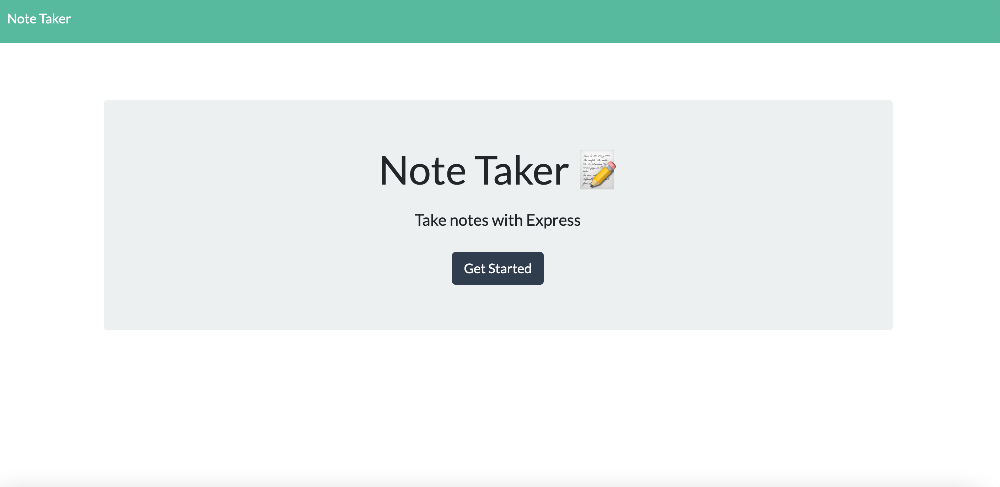

# Note Taker
   

This is an Express.js application application that can be used to write, save and retrieve notes from a JSON file.

# Installation

Clone the repository from GitHub and open using Visual Studio Code.

# Usage 

[Deployed Site](https://abbycav7.github.io/Note-Taker/)

# Credits

Made by Abby Sexton. 

[Express.js](https://www.npmjs.com/package/inquirer)

[Jest](https://jestjs.io/)

[Heroku](https://www.heroku.com/home)

# Questions

[Contact Me](abigail.c.sexton1@gmail.com)

[GitHub](https://github.com/abbycav7)

# License
    
MIT License
    
